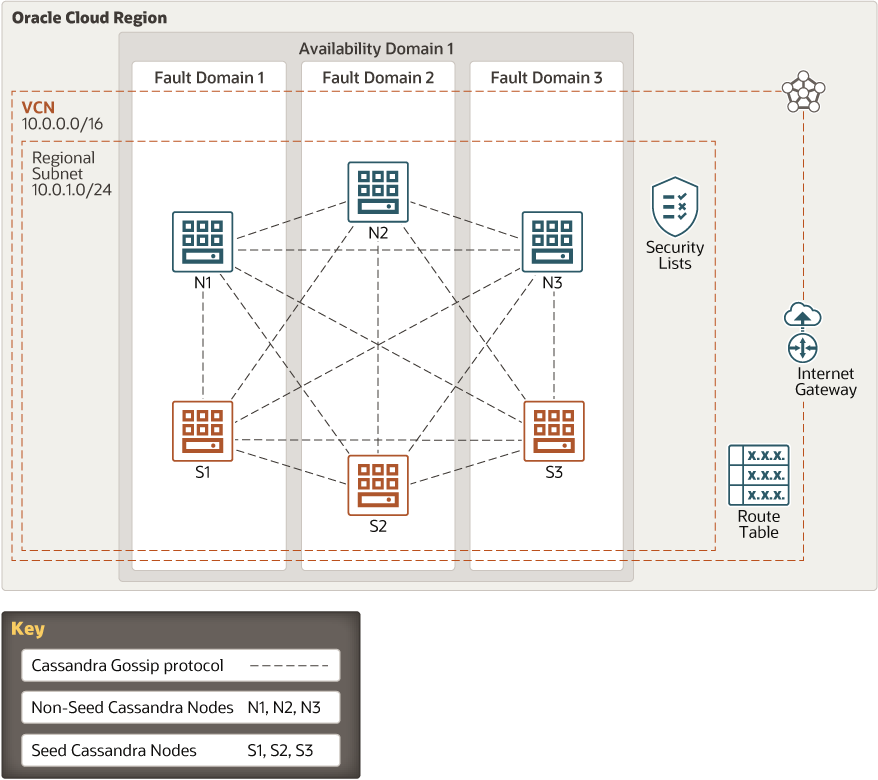

# terraform-oci-cassandra
These are Terraform modules that deploy [Cassandra](http://cassandra.apache.org/) on [Oracle Cloud Infrastructure (OCI)](https://cloud.oracle.com/en_US/cloud-infrastructure).

## About
The Cassandra OCI Module provides a Terraform-based Cassandra cluster installation for Oracle Cloud Infrastructure. Apache Cassandra is a leading NoSQL database providing scalability and high availability without compromising performance. Linear scalability and proven fault-tolerance on cloud infrastructure makes it a compelling solution for mission-critical bid data workloads. Cassandra supports replicating across multiple datacenters, providing lower latency for users and the peace of mind of knowing that you can survive regional outage.



## Prerequisites
1. Download and install Terraform (v0.13 or later)
2. Download and install the OCI Terraform Provider (v4.10 or later)
3. Export OCI credentials (refer to the https://github.com/oracle/terraform-provider-oci)
4. An existing VCN with subnets, and those subnets need internet access in order to download tools and files.

## What's a Module?
A Module is a canonical, reusable, best-practices definition for how to run a single piece of infrastructure, such as a database or server cluster. Each Module is created using Terraform, and includes automated tests, examples, and documentation. It is maintained both by the open source community and companies that provide commercial support.
Instead of figuring out the details of how to run a piece of infrastructure from scratch, you can reuse existing code that has been proven in production. And instead of maintaining all that infrastructure code yourself, you can leverage the work of the Module community to pick up infrastructure improvements through a version number bump.

## How to use this Module
Each Module has the following folder structure:
* [root](): This folder contains a root module called cassandra-node to create a Cassandra cluster in OCI.
* [modules](): This folder contains the reusable code for this Module, broken down into one or more modules.
* [examples](): This folder contains examples of how to use the modules.
  - [example-1](examples/example-1): This is an example of how to use terraform-oci-cassandra-cluster module to deploy a Cassandra cluster in OCI by using an existing VCN, Security list and Subnet.
  - [example-2](examples/example-2): This example creates a VCN (3 ADs scenario) in Oracle Cloud Infrastructure including default route table, DHCP options, security list and subnet (public) from scratch, then use terraform-oci-cassandra-cluster module to deploy a Cassandra cluster.
  - [example-3](examples/example-3): This example creates a VCN (single ADs scenario) in Oracle Cloud Infrastructure including default route table, DHCP options, security list and subnet (public) from scratch, then use terraform-oci-cassandra-cluster module to deploy a Cassandra cluster.
  - [example-4](examples/example-4): This example creates a VCN (single ADs scenario) in Oracle Cloud Infrastructure including default route table, DHCP options, security list and subnets (private for Cassandra, public for Bastion Service) from scratch, then use terraform-oci-cassandra-cluster module to deploy a Cassandra cluster.

To deploy a Cassandra cluster using this Module:

```hcl
module "cassandra" {
  source               = "../../"
  compartment_ocid     = var.compartment_ocid
  node_count           = "3"
  seeds_count          = "3"
  availability_domains = data.template_file.ad_names.*.rendered
  subnet_ocids         = var.subnet_ocids
  vcn_cidr             = var.vcn_cidr
  image_ocid           = var.image_ocid[var.region]
  storage_port         = "7000"
  ssl_storage_port     = "7001"
  ssh_authorized_keys  = file(var.ssh_authorized_keys)
  ssh_private_key      = file(var.ssh_private_key)
  defined_tags         = "<some-tags-you-want-to-add-to-the-nodes>"
}

```

Argument | Description
--- | ---
compartment_ocid | Compartment OCID where VCN is created.
ssh_authorized_keys | Public SSH keys path to be included in the ~/.ssh/authorized_keys file for the default user on the instance.
ssh_private_key | The private key path to access instance.
label_prefix | To create unique identifier for multiple clusters in a compartment.
node_count | The number of Cassandra nodes in the cluster (SEED and Non-SEED nodes).
seeds_count  | The number of Cassandra SEED nodes in the cluster.
availability_domains | The Availability Domain(s) for Cassandra node(s).
subnet_ocids | List of Cassandra node subnets' ids.
vcn_cidr | Virtual Cloud Network's CIDR block.
node_display_name | The name of the Cassandra node.
cluster_display_name | The Cassandra cluster name.
image_ocid | The OCID of an image on which the Cassandra node instance is based. You can refer to https://docs.us-phoenix-1.oraclecloud.com/images/ for more details.
node_shape | Instance shape for node instance to use.
node_flex_shape_ocpus | Number of OCPUs in case of flexible shape usage.
node_flex_shape_memory | Number of GB of memory in case of flexible shape usage.
storage_port | TCP port for commands and data among Cassandra nodes.
ssl_storage_port | SSL port for encrypted communication among Cassandra nodes.
cassandra_version | Version of the Cassandra to be installed.
cassandra_version_code | Cassandra version code for the Apache download URL.
defined_tags | optional tags for Cassandra nodes.
  
## Attribution & Credits
Initially, this project was created and distributed in [GitHub Oracle QuickStart space](https://github.com/oracle-quickstart). For that reason, we would like to thank all the involved contributors enlisted below:
- Lukasz Feldman (https://github.com/lfeldman)
- Ben Lackey (https://github.com/benofben)